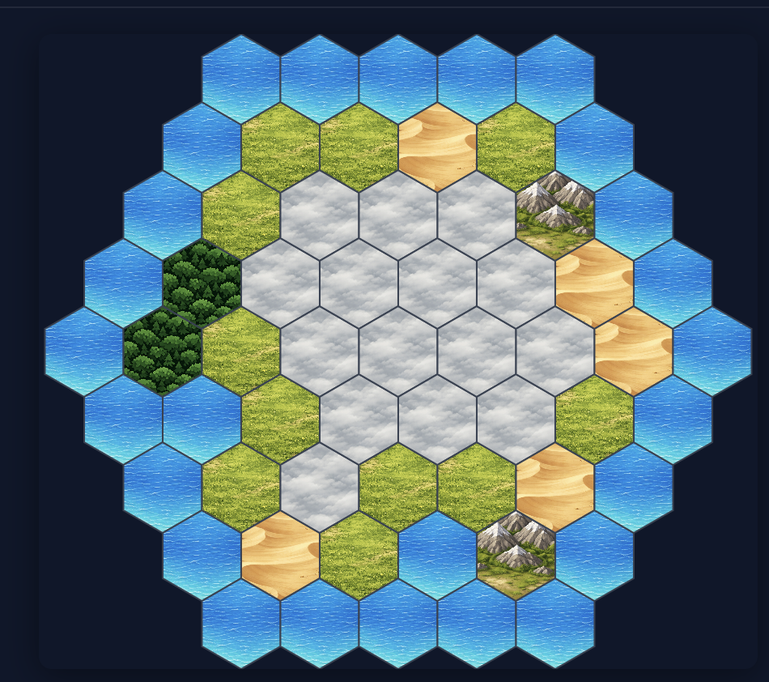

# Overview

## Table of Contents

- [Flavor](#flavor)
- [Practical Overview](#practical-overview)
  - [Winning Conditions](#winning-conditions)
- [Player Types](#player-types)
  - [1. The Hotelier](#1-the-hotelier)
  - [2. The Industrialist](#2-the-industrialist)
  - [3. The Bureaucrat](#3-the-bureaucrat)
  - [4. The Chieftain](#4-the-chieftain)
- [Resources](#resources)
- [The Map](#the-map)
- [Taking Turns](#taking-turns)
- [Starting the Game](#starting-the-game)
  - [Tableaus](#tableaus)
  - [Understanding starting cards](#understanding-starting-cards)
    - [Charter](#charter)
    - [Builder](#builder)
    - [Liaison](#liaison)
    - [Guide](#guide)
  - [Buildings](#buildings)
    - [Resource-Generating Buildings](#resource-generating-buildings)
    - [Industrial Zones](#industrial-zones)
    - [Infrastructure](#infrastructure)
    - [Reserves](#reserves)
    - [Support Buildings](#support-buildings)
    - [Farm](#farm)
    - [Civic Offices](#civic-offices)
    - [Villages](#villages)
  - [Building cadence after Charter](#building-cadence-after-charter)
  - [A typical turn](#a-typical-turn)
- [Victory Conditions](#victory-conditions)
  - [Player counts](#player-counts)
  - [Mandate](#mandate)
  - [Promotion](#promotion)
  - [Seat](#seat)
- [Network](#network)
  - [Network setup](#network-setup)
  - [Network bidding (Guide)](#network-bidding-guide)
- [Resource Market](#resource-market)
  - [Market Setup and Mechanics](#market-setup-and-mechanics)
- [Politics](#politics)
  - [Politics Setup](#politics-setup)
  - [Purchasing Politics cards (Liaison)](#purchasing-politics-cards-liaison)
  - [Resolving Event cards](#resolving-event-cards)

## Flavor

The early 1960s. North American, Japanese, and European economies are booming. That means investors and real estate tycoons are looking for fresh locales to develop. More resources, more tourists, more money. Not everyone is loving this idea: pushback from locals and environmentalists makes for tricky challenges for bureaucrats. But time is running short and everyone wants to get their piece of the pie before it's too late.

## Practical Overview

Landgrab is a strategy game where players take turns placing **Action Tokens** on **Personnel** and **Event** cards. Each turn, a player can place 2 Action Tokens on 2 different cards in their Tableau. Placing an Action Token on a card triggers a specific action associated with that card.

Each action can trigger events across 5 play areas:

1. each player's Tableau;
2. the island Map, comprised of Field, Mountain, Water, Forest, Fog, and Sand hexes;
3. the Resources Market, where players can buy or sell Wood (🪵) and Ore (⚙️) using Money tokens (💰);
4. the Talent Pool, where players can spend 💰 to acquire Personnel cards to add to their Tableau; and
5. the Politics Track, where players can spend Vote tokens (🗳️) to acquire Events cards to add to their Tableau.

Each player has different winning conditions depending on one of four **Player Types:**

### Winning Conditions

1. The Hotelier wins by collecting 💰.
2. The Industrialist wins by collecting ⚙️ and 🪵.
3. The Chieftain wins by reserving undeveloped hexes on the map.
4. The Bureaucrat wins by collecting 🗳️.

After collecting a certain number of cards, the player can win the game using the Mandate card to achieve a victory.

# Player Types
There are four player types: the Hotelier, the Industrialist, the Bureaucrat, and the Chieftain. Each player begins with 4 cards in their Tableau.

# 1. The Hotelier
> From paradise to parking lots!
- **The Hotelier** can build Resort and Housing Buildings on Sand and Field hexes.

# 2. The Industrialist 
> You see a forest? I see Ikea furniture.
- **The Industrialist** can build Industrial Zone and Farm Buildings on Sand and Field hexes.

# 3. The Bureaucrat
> You'll need a permit.
- **The Bureaucrat** can build Civic Offices and Infrastructure on Sand and Field hexes.

# 4. The Chieftain
> Go away.
- **The Chieftain** can place Villages on Fog hexes and Reserves on Mountain, Forest, Sand, and Field hexes.

# Resources
- **💰 - Money Tokens:** The basic currency of the game. Used to build buildings, bid for Personnel cards, and buy 🪵 and ⚙️ from the Resources Market.
- **🪵 - Wood:** 1 🪵 is required to build any building. Can be generated by the Industrialist player for each Forest hex adjacent to each Industrial Zone. Can also be bought or sold on the Resources Market.
- **⚙️ - Ore:** 1 ⚙️ is used to build any building. Can be generated by the Industrialist player for each Mountain hex adjacent to each Industrial Zone. Can also be bought or sold on the Resources Market.
- **🗳️- Votes:** Used to purchase Event cards from the Politics track. Can be generated by the Bureaucrat player, where 1 🗳️ is generated for each building adjacent to an Infrastructure.

# The Map



Players place buildings on hexes on an island map. A player can typically place a Building only on Sand and Field tiles. Resources are generated from buildings according to adjacency bonuses, discussed in [Buildings](#Buildings).

# Taking Turns

Each player starts the game with two Action Tokens. A player takes an action by placing one of her Action Tokens on one of the cards in her Tableau, triggering the action related to that card. This means each player takes two actions per turn.

When the player begins their next turn, she takes her Action Tokens off the cards from her Tableau and then places the first Action Token on a card to take her first action.

# Starting the Game

Each player starts the game with the following resources:
```
5 💰
1 🪵
1 ⚙️
1 🗳️
```

At the start of a game, players make a blind bid to determine who goes first. Each player wagers 0-5 💰 from their resources; whoever bids highest pays the wagered amount and takes the first turn. If there is a tie, a player is randomly chosen from the tied players and pays 1 💰 to take the first turn.

A player then places her Action Token on a card from her Tableau to take the first of two actions for her turn.

## Tableaus

Each player has a Tableau comprised of cards. Each player starts the game with 4 cards in their Tableau. Additional cards can be added later. A player can have a maximum of 8 cards in their Tableau. The starting Tableau for the Hotelier, Industrialist, and Bureaucrat has:

1. Builder,
2. Guide,
3. Liaison, and
4. Charter.

- The Chieftain's starting Tableau has Elder, Guide, Liaison, and Charter cards.

## Understanding starting cards

Players begin the game with the following cards in their Tableau. Placing an Action Token on one of these cards triggers that card's action according to the rules below.

### Charter
#### ⚡ Place a Resort, Industrial Zone, Infrastructure, or Village, according to player type. Building can be placed adjacent to Fog hexes. Fog hexes adjacent to the placed Building are revealed.
- Notes: This card is used for each player to place their first building on the map at no cost. This is an Event card, so after an Action Token is placed on this card, it is removed from the player's Tableau. A Building placed with Charter does not need to be adjacent to another building.

### Builder
#### 👤 Pay 1 🪵, 1 ⚙️, and 1 💰 to place a Building OR buy/sell 1 type of resource from the Resources Market.
- When placing a Building, payment is made to the bank (not the Resources Market). Buildings are placed according to the following rules:
  1. A building must be placed adjacent to another building owned by the placing player, or next to an Infrastructure owned by any player.
  2. A building cannot be placed adjacent to Fog.
  3. Player types can build the following buildings:
    - The Hotelier can build a Resort or Housing.
    - The Industrialist can build an Industrial Zone or Farm.
    - The Bureaucrat can build an Infrastructure or Civic Offices.
    - The Chieftain can use the Elder to place a Village (on Fog - can be placed adjacent to Fog) or a Reserve.
- Using the Resource Market is explained in the [Resource Market](#resource-market) section.

### Liaison
#### 👤 Generate resources from buildings OR pay 🗳️ to acquire an Event card from the Politics track.
- Resources are generated according to each building's adjacency bonuses.

### Guide
#### 👤 Select a non-Fog hex and reveal all Fog hexes adjacent to that hex OR pay 💰 to bid on a Personnel card from the Network.

## Buildings

Each player can build two types of buildings. **Adjacency** means hexes sharing a border.

### Resource-Generating Buildings
#### Resorts
Each Resort generates 1 💰 for every adjacent Mountain, Water, and Forest hex; and also if the Resort is placed on a Sand and also adjacent to Water (this represents a "beach resort" bonus, i.e. the Resort is on sand and next to water, so is considered to be on a beach and is accordingly more appealing to tourists). A Resort generates 1 💰 less for each adjacent Industrial Zone or Infrastructure.

### Industrial Zones
Each Industrial Zone generates 1 🪵 for every adjacent Forest hex and 1 ⚙️ for every adjacent Mountain hex. Cannot generate resources from hexes that have Reserves placed on them.

### Infrastructure
Each Infrastructure produces 1 🗳️ for the Bureaucrat for each adjacent Building owned by other players. Any player with any number of Buildings adjacent to Infrastructure also receives 1 Vote per building adjacent to an Infrastructure.

### Reserves
Must be placed adjacent to a Reserve or Village. Each Reserve generates 1 💰 if that Reserve is adjacent to a Village and is not adjacent to another player's Building.

### Support Buildings

#### Housing
The Hotelier builds Housing on Sand or Field hexes. Housing does not generate 💰 from the Liaison resource-generation action unless an Event says otherwise.

### Farm
The Industrialist builds Farms on Sand or Field hexes. Farms do not generate 🪵 or ⚙️ from the Liaison resource-generation action unless an Event says otherwise.

### Civic Offices
The Bureaucrat builds Civic Offices on Sand or Field hexes. Civic Offices do not generate 🗳️ from the Liaison resource-generation action unless an Event says otherwise.

### Villages
The Chieftain builds Villages on Fog (via Charter and **Elder** actions). Villages are used for Presence and Chieftain-specific Event effects.

## Building cadence after Charter
After placing with **Charter**, normal placement rules apply. Hotelier, Industrialist, and Bureaucrat players can have a maximum of one more Resource-Generating Buildings than Support Buildings. The Chieftain does not have any limit on the number of Reserves she can play in relation to the number of Villages.

- When using Builder to place Buildings, a Building must be placed adjacent to another Building owned by the player OR be placed adjacent to an Infrastructure building owned by any player.
- Elder can be used to place a Village on any Fog hex; a Reserve must be placed adjacent to a Village or Reserve. A Reserve cannot be placed adjacent to a Fog hex.

## A typical turn
1. At the start of your turn, take your two Action Tokens onto your playmat (or refresh them). You must use **two different cards** in your Tableau this turn—place at most one token per card.
2. For each Action Token, choose a card in your Tableau, place the token on it, and resolve that card's effect:
   - **Personnel** (Builder, Liaison, Guide; or **Elder** for the Chieftain): resolve the option you choose; the Personnel **remains** in your Tableau unless an Event or the Network rules remove it.
   - **Charter:** resolve placement, then **remove Charter from your Tableau** (it is a one-shot Event).
   - Any other **Event** card: resolve its text, then **remove that Event from your Tableau** unless the Event says it stays.
3. If an Event grants you a follow-up choice (e.g. Import *or* Export), make that choice when you resolve the Event.
4. At end of turn, apply any end-of-turn rules (Politics refill, Resource Market restock, etc.). Then the next Player to your right takes her turn.

You may acquire new cards only when rules allow (e.g. Liaison + Politics track, Guide + Network, or card text). Your Tableau may hold at most **8** cards; if you would exceed that, you cannot take the acquisition until you free a slot (for example, when one-shot Events leave your Tableau).

# Victory Conditions
A player wins by acquiring **3 Seats**. Seats are earned by purchasing and playing **Mandate** cards from the Politics track (see [Mandate](#mandate)).

### Player counts
- **2 players:** Hotelier, Industrialist  
- **3 players:** Hotelier, Industrialist, and either Chieftain or Bureaucrat  
- **4 players:** Hotelier, Industrialist, Chieftain, Bureaucrat  

## Mandate
Mandate cards are interleaved into the Politics deck on a schedule: the first Mandate appears after 5 regular Politics cards, then after 4, then 3, then 2, and every 2 cards thereafter. When a Mandate is drawn to fill a market slot, it occupies the 4-🗳️ slot, with other cards shifted to cheaper positions if needed. If a Mandate is drawn but one is already visible in the market, the duplicate goes to the bottom of the Politics draw deck and the next card is drawn instead.

A Mandate cannot be Bribed or otherwise removed from the market; it can only be purchased. A player may only acquire a Mandate as the **first Action Token placement of their turn**. Resolving a Mandate adds a **Promotion** Event and a **Seat** card to your Tableau (or your score pile, if you track Seats separately—either way, follow Promotion and Seat below). **Your turn ends immediately** after you finish resolving the Mandate and Promotion (you do not place a second Action Token).

The cost of a Mandate is based on player type plus the number of Seats you already have (**Seat#**):

| Player Type   | Mandate cost | Notes |
|---------------|--------------|-------|
| Hotelier      | 10 💰 + Seat# | Seat# = Seats already held |
| Industrialist | 10 🪵 and/or ⚙️ + Seat# | Any mix of Wood and Ore |
| Bureaucrat    | 10 🗳️ + Seat# | |
| Chieftain     | Presence Score ≥ 10 + Seat# | Presence Score = number of Reserves plus Villages adjacent to a Reserve |

Pay those costs to the bank (and meet the Presence threshold for the Chieftain) when you take the Mandate from the Politics track.

## Promotion
When **Promotion** enters your Tableau, resolve it immediately: **remove every Event card from your Tableau** (Personnel stay). Then add a **Dividends** Event card to your Tableau. If this would exceed 8 cards, discard or trash Events you choose until you have room, then add Dividends.

## Seat
Resolve **Seat** to gain **1 Seat**. After resolving, remove **Seat** from your Tableau (or move it to a scored pile). At **3 Seats**, you win.

# Network
Personnel are hired through the **Network** row. Use the **Guide's** second "talent scouting" ability to spend 💰 to start a bid.

## Network setup
**Network row:**   [ ]  |  [ ]  |  [ ]  |  [ ]

At the start of the game, the Network row is comprised of:

1. Broker
2. Forester
3. Fixer
4. Adman

## Network bidding (Guide)
Instead of taking the Guide's Expedition option, you may use a Guide to bid on a Personnel card from the Network row:

1. Choose one Personnel card in the Network row you want to hire and add to your Tableau. 
2. Make a blind bid: the initiating player must bid at least **1 💰**; any other players who wish to bid must also bid at least **1 💰**. The player with the highest bid takes the Personnel and adds it to her Tableau.
3. If there is a tie, the tying players make an additional bid, and any **💰** tokens bid in the next round are forfeited, regardless of who wins the next bid. This continues for additional ties.

After the Personnel is removed from the Network row, replenish the Network row with a new Personnel card.

**Examples of Personnel that can appear in the Network row:**

- **Forester:** Adds **Logging** or **Forestry** Events to your Tableau (your choice)—same hex effects as in the [Politics](#politics) list. 
- **Consultant:** Adds the **Reorganization** Event to your Tableau.
- **Broker:** Acquire 1 🪵 or 1 ⚙️ for 1 💰 OR acquire 1 💰 for 1 🪵 or 1 ⚙️.
- **Fixer:** Exchange 1 💰 for 1 🗳️ OR exchange 1 🗳️ for 1 💰.

Generally, Personnel cards are not as versatile or as strong as each player's starting cards or as strong as the Event cards which are only played once. However, these cards can be very useful for players who may otherwise be blocked on the map by a Forest or who may have no easy way to acquire 🗳️s or other resources.

# Resource Market

## Market Setup and Mechanics

Each resource (Wood and Ore) has a market row with four price slots (1–4 💰). A slot either contains a resource token (available to buy) or is empty. Each Wood or Ore can be bought from the Resource Market for 1, 2, 3, or 4 💰 depending on the slot.

Here is an example of the Resource Market when **full**—one possible setup at game start:

| Price: | 1 | 2 | 3 | 4 |
|--------|---|---|---|---|
| Ore:   | ● | ● | ● | ● |
| Wood:  | ● | ● | ● | ● |

- When a player **purchases** resources using the **Builder** action's Resource Market option:
  - Pay 💰 equal to the sum of the slot prices you take; always take the **cheapest** available tokens first (take from the low-number slots rightward). Remove those tokens from the track.
  - *Example:* You use your second Action Token on **Builder** (market option). You buy all 4 Ore on the Ore track and pay **10 💰** (1 + 2 + 3 + 4). Your turn then ends; at end of the turn, if a row is empty, add 1 token to the 4 💰 column per the rule below. The next player might use **Builder** to buy that Ore for 4 💰.
- When a player **sells** resources using the **Builder** action's Resource Market option:
  - Place sold resources into the **highest-priced empty slots first**, working leftward. Gain 💰 equal to the sum of the prices of the slots you filled.
  - *Example:* At the start of your turn the tracks are as empty as possible:

| Price: | 1 | 2 | 3 | 4 |
|--------|---|---|---|---|
| Ore:   |   |   |   | ● |
| Wood:  |   |   |   | ● |

You place an Action Token on **Builder** (market) and sell **3 Wood**. You gain **6 💰** (slots 1 + 2 + 3) and fill those Wood slots. The next player places their Action Token on **Builder** as well (market) and sells her spare Ore for **6 💰** in the same way. At end of that action, both Resource Rows would be full again:

| Price: | 1 | 2 | 3 | 4 |
|--------|---|---|---|---|
| Ore:   | ● | ● | ● | ● |
| Wood:  | ● | ● | ● | ● |

- If, at the **end** of a player's turn, a resource row is **empty**, place **1** Ore or **1** Wood in that row's **4 💰** column (emergency import). Hoarding hurts but cannot deny players access to the market forever.

# Politics

## Politics Setup

| Cost (🗳️) | 0 | 1 | 2 | 3 |
|-----------|---|---|---|---|
| Card:     | [A] | [B] | [C] | [D] |

The four starting Politics cards are:

1. Graft  
2. Import  
3. Roads & Sewage  
4. Favour  

The Politics track holds **4 Event cards** that players acquire by paying **🗳️** listed on each slot—this is the **Politics** option from **Liaison** (see [Starting cards](#starting-cards)). After a player acquires a card from the Politics track and their turn ends, slide remaining cards toward the cheaper slots and draw a new card into the rightmost (3 🗳️) slot.

The Event cards on the track are managed differently depending on whether the Bureaucrat is in the game:

a. **With Bureaucrat:** After the Bureaucrat's turn ends and the Politics track has been refilled, the Bureaucrat may **reorder** the visible Politics cards however they wish. 
b. **Without Bureaucrat:** The order of cards on the track stays as dealt unless reorganized with an Event card.

## Purchasing Politics cards (Liaison)
On **Liaison**, when you choose the Politics option:

- Pay **🗳️** equal to the slot's cost (0, 1, 2, or 3).  
- Add that Event card **to your Tableau** (maximum 8 cards total).  
- If a **non-Bureaucrat** player paid **2 or 3 🗳️** for that card, the **Bureaucrat gains 1 🗳️** from the bank.

You still **generate resources** from Liaison when you choose the resource-generation option instead; keep in mind that you can only play 1 Action Token on 1 card each turn, so generating resources prevents a player from using the Liaison to acquire a card from Politics in that turn.

## Resolving Event cards
When you place an Action Token on an **Event** in your Tableau, resolve it, then **remove it from your Tableau**. **Mandate**, **Promotion**, and **Seat** follow the special timing in [Victory Conditions](#victory-conditions).

The following Event cards can appear in the Politics track (or enter your Tableau via Network or other effects):

1. **Bribe**: Pay 1 💰 and remove **1 non-Mandate** card from the Politics track; immediately reorganize the cards in the Politics track.
2. **Zoning**: Place a Zoning marker on a Sand or Field hex adjacent to one of your buildings. Only you may build on that hex.  
3. **Urban Planning**: Pay 1 🪵, 1 ⚙️, and 1 💰 to place an **Urban Planning** token on one of your Resource-Generating Buildings. That Building now produces **double** resources when you use **Liaison**'s resource-generation option for it (same resource types as normal).  
4. **Dividends**: Gain 1 💰 per Industrial Zone, Resort, Village, or Infrastructure you control.  
5. **NGO Backing**: Chieftain gains 1 💰 per Village.  
6. **Propaganda**: Pay 1–3 💰 to the bank and collect 1–3 🗳️ from other players, taking at most 1 🗳️ from each player (e.g. pay 2 💰 and collect 2 🗳️ from 2 players).  
7. **Conservation**: Place a Conservation token on any Forest hex. That hex cannot be converted or zoned; only a Reserve may be placed on it.  
8. **Local Elections**: Chieftain gains 1 🗳️ per Village.  
9. **Subsidy**: Gain 1 💰 per Reserve you control.  
10. **Boycott**: Choose a player. On their next **Liaison** resource-generation resolution, their buildings adjacent to **your** Reserves and Villages produce nothing.  
11. **Protests**: Choose a player. They lose 🗳️ equal to the number of Villages you control, to a maximum of 3 🗳️.  
12. **Taxation**: Choose one of your Reserves. Gain 1 💰 per opponent building adjacent to that Reserve.  
13. **Levy**: Choose a player. They lose up to 2 💰.  
14. **Expropriation**: Force the Industrialist to add 1–3 🪵 and/or ⚙️ (any mix) to the Resource Market; the Industrialist receives 1 💰.
15. **Graft**: Exchange 1 💰 for 1 🗳️ or 1 🗳️ for 1 💰 with another player.  
16. **Reorganization**: Pick **two** different options: remove a Personnel card in your Tableau from the game; **or** draw the top Event from the Event deck into your Tableau if you have room; **or** place **one additional Action Token** this turn on a card you have not already used this turn (a third action).  
17. **Import**: Acquire 1 🪵 or 1 ⚙️ for 1 💰. This resource does **not** come from the Resource Market.  
18. **Export**: Sell 1–3 🪵 and/or ⚙️ (any mix) for the same number of 💰. Sold resources do **not** return to the Resource Market.  
19. **Logging**: Convert a Forest hex to a Field hex. Take 1 🪵 from the bank.  
20. **Forestry**: Convert an empty Field hex to a Forest hex.
